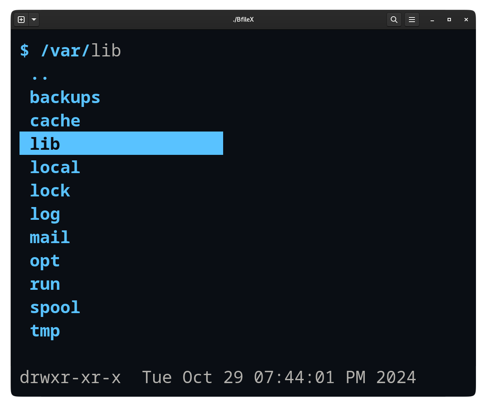

# BFileX - Terminal-Based File Explorer

A simple, color-coded terminal file explorer with intuitive navigation and file management, built using `Terminal++` and `std::filesystem`.

## Features
- **Navigation**: Move up and down the file list with `j` (down) and `k` (up). Enter directories with `l` and return to the parent directory with `h`.
- **File Opening**: Open files using the default application for your operating system.
- **File Sorting**: Directories are ranked above files, and all items are sorted alphabetically.
- **Permissions & Metadata**: View UNIX-style permissions and last modified timestamps.
- **Color-Coded UI**: Directories, regular files, and other file types are displayed in distinct colors for readability.

## Screenshots

<p align="center">
    
    
</p>

## Installation

### Prerequisites
- **C++17** or newer.
- **Terminal++**: Ensure `Terminal++` is added as a submodule by running:
    ```bash
    git submodule update --init --recursive
    ```

### Clone and Build
1. Clone the repository:
    ```bash
    git clone https://github.com/BahaaMohamed98/BfileX.git
    cd BfileX
    ```
2. Build with your preferred method (using CMake here as an example):
    ```bash
    cd build
    cmake ..
    make
    ```

3. Run the explorer:
    ```bash
    ./BFileX
    ```

## Usage
- **Move Down**: Press `j` or `Tab`.
- **Move Up**: Press `k`.
- **Enter Directory/Open File**: Press `l` or `Enter`.
- **Go Back**: Press `h`.
- **Quit**: Press `q` or `Esc`.