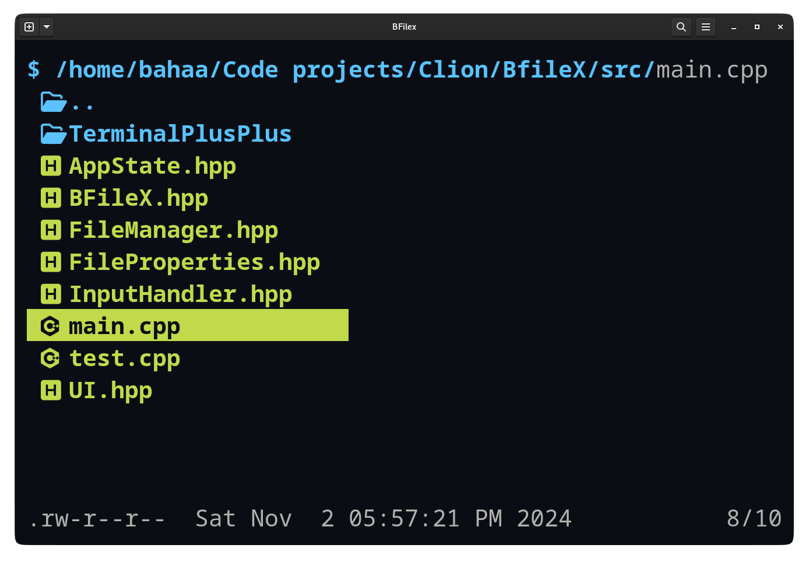

# BFileX

A modern, lightweight terminal file explorer written in C++. BFileX provides an intuitive interface for navigating and managing your files with vim-style keybindings and a color-coded display.

## ✨ Features

- 🎨 Color-coded interface for different file types
- 📁 Vim-style navigation
- 🚀 Fast and lightweight
- 🔍 File type detection with custom icons
- 📊 Detailed file information (permissions, size, modified date)
- 🖥️ Cross-platform support (Linux, macOS, Windows)
- 🔄 Real-time updates for file system changes

## 🖼️ Screenshots

<div align="center">
  
  
  
  <br/>
  <em>BFileX running in terminal with color-coded files and icons</em>
</div>

## 🚀 Installation

### Prerequisites
- C++17 or higher
- CMake 3.15 or higher
- Git

### Build from Source

#### Clone the repository
```bash

git clone https://github.com/BahaaMohamed98/BfileX.git
cd BfileX
```

#### Initialize submodules
```bash
git submodule update --init --recursive
```

#### Build using Cmake
```bash
cd build
cmake ..
make
```
#### Run the app
```bash
./BFileX
```

## 🎮 Default Keybindings

| Key            | Action                    |
|----------------|---------------------------|
| `j` or `Tab`   | Move down                 |
| `k`            | Move up                   |
| `l` or `Enter` | Open file/Enter directory |
| `h`            | Go to parent directory    |
| `r`            | Rename file/directory     |
| `d`            | Delete file/directory     |
| `p`            | Toggle preview            |
| `t`            | Toggle sorting by time    |
| `q` or `Esc`   | Quit                      |
