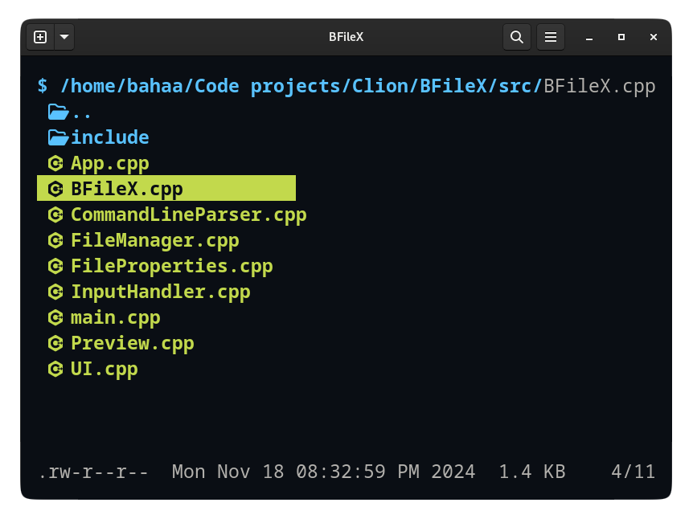

# BFileX

<div align="center">
  
</div>

A modern, lightweight terminal file explorer written in C++. BFileX provides an intuitive interface for navigating and
managing your files with vim-style keybindings and a color-coded display.

## ✨ Features

- 🎨 Color-coded interface for different file types
- 𝐕I Vim-style navigation
- 🚀 Fast and lightweight
- 🔍 File type detection with custom icons
- 📊 Detailed file information (permissions, size, modified date)
- 🖥️ Cross-platform support (Linux, macOS, Windows)
- 🔄 Real-time updates for file system changes
- ⬆️ Comprehensive keybindings for navigation and actions
- 📁 Directory management: Create, rename, and delete directories on the fly

## 🖼️ Screenshots

Explore how BFileX looks and works in different scenarios:

<details>
  <summary><b>Main Interface</b></summary>
  <div align="center">
    
    </div>
  <div align="center">
    
    <br/>
    <em>BFileX source code entries displayed</em>
  </div>
</details>

<details>
  <summary><b>File Preview</b></summary>
  <div align="center">
    
  </div>
  <div align="center">
    
    <br/>
    <em>File preview for a text file</em>
  </div>
</details>

<details>
  <summary><b>Directory Management</b></summary>
  <div style="margin-left: 20px;">
    <details>
      <summary><b>Make Directory</b></summary>
      <div align="center">
        
        <br/>
        <em>Creating a new directory</em>
      </div>
      <br/>
      <div align="center">
        
        <br/>
        <em>Newly created directory highlighted in the list</em>
      </div>
    </details>
    <details>
      <summary><b>Rename File/Directory</b></summary>
      <div align="center">
        
        <br/>
        <em>Renaming a selected file or directory</em>
      </div>
    </details>
    <details>
      <summary><b>Delete File/Directory</b></summary>
      <div align="center">
        
        <br/>
        <em>Deleting a file or directory</em>
      </div>
      <br/>
      <div align="center">
        
        <br/>
        <em>Confirmation for recursive deletion of directories</em>
      </div>
    </details>
  </div>
</details>

## 🚀 Installation

### Prerequisites

- C++17 or higher
    - CMake 3.15 or higher
    - Git

### Build from Source

#### Clone the repository

```bash

git clone https://github.com/BahaaMohamed98/BfileX.git
cd BfileX
```

#### Initialize submodules

```bash
git submodule update --init --recursive
```

#### Build using Cmake

```bash
cd build
cmake ..
cmake --build .
```

#### Run the app

```bash
./BFileX
```

## ⚙️ Command-Line Options

| Option                | Description              |
|-----------------------|--------------------------|
| `-t`, `--time`        | Sort entries by time     |
| `-s`, `--size`        | Sort entries by size     |
| `-r`, `--reverse`     | Reverse the sort order   |
| `-a`, `--all`         | Show all entries         |
| `-np`, `--no-preview` | Don't show file previews |
| `-h`, `--help`        | Show help screen         |

## 🎮 Default Keybindings

| Key                                                   | Action                        |
|-------------------------------------------------------|-------------------------------|
| <kbd>j</kbd>, <kbd>Tab</kbd>, <kbd>Right Arrow</kbd>  | Move down                     |
| <kbd>k</kbd>, <kbd>Up Arrow</kbd>                     | Move up                       |
| <kbd>l</kbd>, <kbd>Enter</kbd>,<kbd>Right Arrow</kbd> | Open file/directory           |
| <kbd>h</kbd>, <kbd>Left arrow</kbd>                   | Go to parent directory        |
| <kbd>m</kbd>                                          | Make a new directory          |
| <kbd>r</kbd>                                          | Rename current entry          |
| <kbd>d</kbd>                                          | Delete current entry          |
| <kbd>t</kbd>                                          | Toggle sorting by time        |
| <kbd>s</kbd>                                          | Toggle sorting by size        |
| <kbd>R</kbd>                                          | Toggle reversing entries      |
| <kbd>H</kbd>                                          | Toggle showing hidden entries |
| <kbd>p</kbd>                                          | Toggle preview                |
| <kbd>q</kbd>                                          | Quit                          |

## 📄 License

This project is licensed under the Apache 2.0 License - see the [LICENSE](LICENSE) file for details.